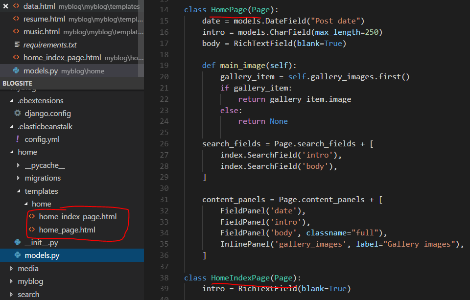

## Basic Set Up
Create the environment outside the working folder
```
virtualenv website
website\Scripts\activate
```
In the working folder
```
pip freeze > requirements.txt
wagtail start myblog
cd myblog
python manage.py migrate
python manage.py createsuperuser
python manage.py runserver
```
## Wagtail - Page Model, Page, and Template
The **Page** and its **editor interface** in Wagtail admin are created through Django **model**. All page models must inherit from the *wagtail.wagtailcore.models.Page* class. **Each** Page Model corresponds to **one** Page from Wagtail admin. **Each** Page points to one HTML **template** as the frontend. [Page Reference](http://docs.wagtail.io/en/v1.13.1/topics/pages.html)  
### Page Model
The **Page Model** defines:
* **Fields** - It defines database fields of the Page, you can use any field type that Django provides.  
* **Editing Pannel** - It defines the capabilities and the layout of the editing interface. The syntax is *content_panels*.  

Run ```python manage.py makemigrations```, then ```python manage.py migrate`` to update the database with your model changes. You must run the above commands each time you make changes to the model definition.  
### Page and its hierachical tree structures
The Page in Wagtail Admin follows the concept of **hierachical tree structures** consisting of nodes and leaves. You can create as many as pages as **children** of a different page. In this case, you create BlogPage as child of the BlogIndexPage, and you can access BlogPage instances using *.get_children* method in **blog_index_page.html** template as below.
```html

    <h2><a href="">{{ post.title }}</a></h2>
    {{ post.specific.intro }}
    {{ post.specific.body|richtext }}

```
### Template
A HTML template must be created for each page model. Wagtail targets the template using the App name followed by Page Model name seperated by underscore. (e.g. HomePage within the ‘home’ app becomes home/home_page.html)  
  

#### Template Context
Wagtail renders templates with the **page** variable bound to the page instance being rendered. Use this to access the content of the page. For example, to get the title of the current page, use ```{{ page.title }}```.  
The template context can be customized using **get_context** method. Below is an example.  
```python 
class BlogIndexPage(Page):

    def get_context(self, request):
        context = super(BlogIndexPage, self).get_context(request)

        # Add extra variables and return the updated context
        context['blog_entries'] = BlogPage.objects.child_of(self).live()
        return context
```
The variable *blog_entries* can be used in the template:
```
{{ page.title }}


    {{ entry.title }}

```
### Configuring Instance Behavior 
Elastic Beanstalk instances can be configured using a .ebextensions folder in the root of the repository. YAML configuration files placed in this folder will be read in alphabetical order so configuration files can easily be split up to run in stages by prefixing their file names with a number. [reference](https://thinkster.io/tutorials/deploying-a-django-application-to-elastic-beanstalk)  
